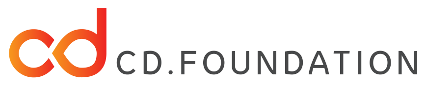
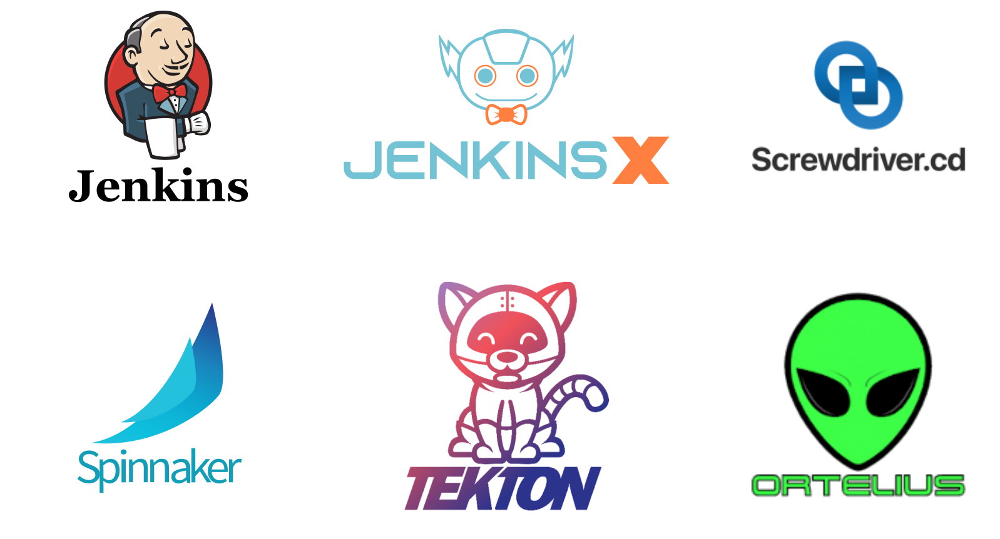
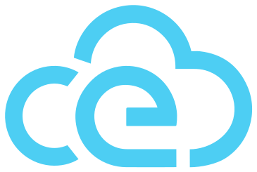

## Events in CI/CD
 
 

### Andrea Frittoli
#### IBM, Tekton

 
FOSDEM | CI/CD Devroom | 07.02.2021

---

## The Single Tool

 <!-- .element height="30%" width="30%" -->

notes: Organizations often find one single tool that satisfies all their needs of CI/CD... or not really

-----

<!-- .slide: data-transition="zoom-in fade-out" -->

 <!-- .element height="80%" width="80%" -->

-----

<!-- .slide: data-transition="fade" -->
<!-- .slide: data-transition-speed="fast" -->

### The Single Protocol

 <!-- .element height="60%" width="60%" -->

notes: And these different platforms all speak the same language... or not really again. The data model is different, platforms can range from generic to very opinionated and so their dictionaries can be very different.

-----

### An Heterogeneous Landscape

* Different data models
* Varying scope
* From generic to specific

---

## Event based integration

* Decoupling
* Scalability
* Resiliency

notes: Discuss the benefits of event driven integration between the various platforms.

-----

It still requires point to point integrations
 

...as we may get lost in translation

 

* Activity
* Pipeline
* Workflow

* Build
* Task
* Step

notes: Platform X reacts to events from platform Y
Platform X understand terminology from platform Y

-----

### How can we solve this?

* Collaboration
* Standardization

notes: collaboration may help, standardization were possible

---

## Events in CI/CD
### for Interoperability

 
Open source technologies represented:
 

<!-- .element height="30%" width="30%" -->

notes: While the group is hosted @ CDF, its scope is not limited to CDF hosted projects

-----

### Interoperability SIG

 <!-- .element height="30%" width="30%" -->

<!-- .element height="40%" width="40%" -->

see [The road to interoperability in CI/CD](https://fosdem.org/2021/schedule/event/the_road_to_interoperability_in_ci_cd/) @ FOSDEM 2021

notes: SIG: Since 2020, CDF: Since 2019

-----

### Events in CI/CD

* Interoperability between CI/CD systems
* Common protocol
* Common terminology

notes: The events in CI/CD group was initially created to evaluate how events can be used in the context of interoperability

-----

<!-- .element height="40%" width="80%" -->

notes: We want to avoid creating a new standard. Cloud events + metadata

-----

### Protocol

We plan to use [CloudEvents](https://cloudevents.io/) (CNCF) as our base protocol.
 
<!-- .element height="15%" width="15%" -->

-----

### Events

[Definition by CloudEvents](https://github.com/cloudevents/spec/blob/v1.0/spec.md#terminology):

> An *event* is a data record expressing an *occurrence* and its context, where *occurrence* is the capture of a statement of fact during the operation of a software system.

* A change was proposed in git
* A build artifact was generated
* A task was started

-----

### Problems we are working on

 

* Shared Vocabulary
* Structure: lightweight vs. "complete"
* Relations: links, order, uniqueness
* Patterns: descriptive vs. prescriptive events

  

→ More than interoperability ←

---

## Events in CI/CD
### Special Interest Group

* Proposed in 2021
* Own Charter

* Extend the scope beyond interoperability
* Give more visibility, attract contributions

-----

### Charter

> Research how events can be used to advance CI/CD systems as a common format for integration, to drive decoupled, resilient and scalable architectures.

(provisional)

-----

### Areas of investigation

* Events as triggers, decoupled workflows
* Events for monitoring and auditing
* Orchestration and tracing for events based workflows
* Best practices

-----

### How to contribute

* Join the [#events-in-cicd channel](https://cdeliveryfdn.slack.com/archives/C0151BTKEJX) on CDF Slack
* Bi-weekly [meetings](https://github.com/cdfoundation/sig-interoperability/blob/master/workstreams/events_in_cicd/meetings.md)
* Group [README](https://hackmd.io/AnVkdMb3QEeVQXKfIj4tNQ)
* We welcome uses cases, ideas, collaboration, code and positive vibes

---

## Thank You

#### Come and join us!

-----

## References

* CD Foundation: https://cd.foundation/
* Interoperability SIG: https://github.com/cdfoundation/sig-interoperability
* Events in CI/CD work-stream: https://github.com/cdfoundation/sig-interoperability/tree/master/workstreams/events_in_cicd
* Slides: https://afrittoli.github.io/events-in-cicd/